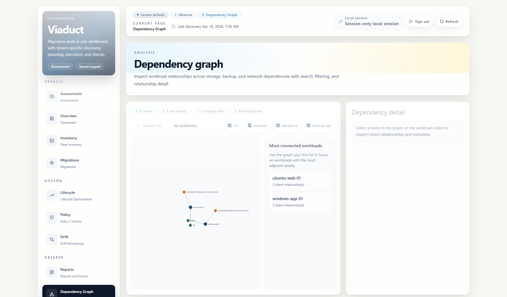
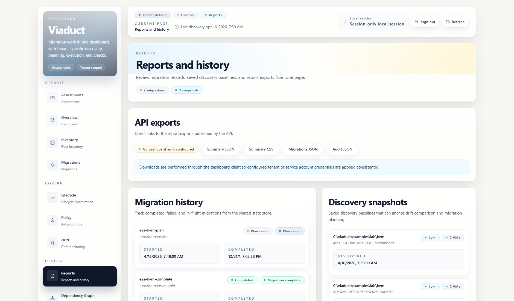

# Screenshot Assets

This directory contains the current release-facing dashboard screenshots for Viaduct.
The PNG captures are generated from the seeded Playwright fixture runtime and reflect the current packaged dashboard shell, not illustrative mockups.

Use these images in:
- the root `README.md`
- release notes
- evaluator packets
- demo prep
- workflow docs when the dashboard changes materially

The matching evaluator artifact checklist lives in [../pilot-evidence-kit.md](../pilot-evidence-kit.md).

## Current Files

- [Keyless local dashboard entry](auth-bootstrap.png)
- [Assessment overview](pilot-workspace.png)
- [Inventory assessment](inventory-assessment.png)
- [Dependency graph](dependency-graph.png)
- [Migration operations](migration-ops.png)
- [Reports and history](reports-history.png)

## Historical Files

- [Pilot bootstrap SVG](pilot-bootstrap.svg)
- [Assessment workflow SVG](pilot-workspace-flow.svg)

The SVG files remain for older release notes that referenced them directly. They predate the current Get started wording and are kept only for historical release collateral. New release-facing docs should prefer the PNG captures above.

## Refresh

From [`web/`](../../../../web/README.md):

```bash
npm run screenshots:readme
```

## Preview






