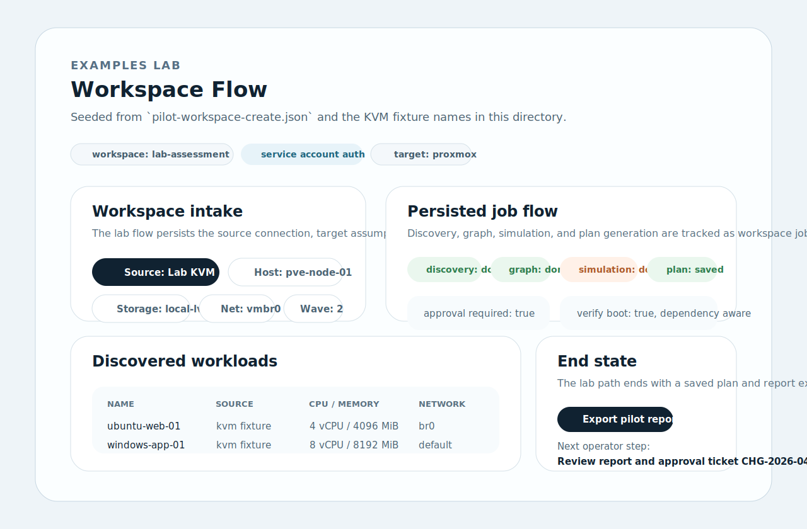
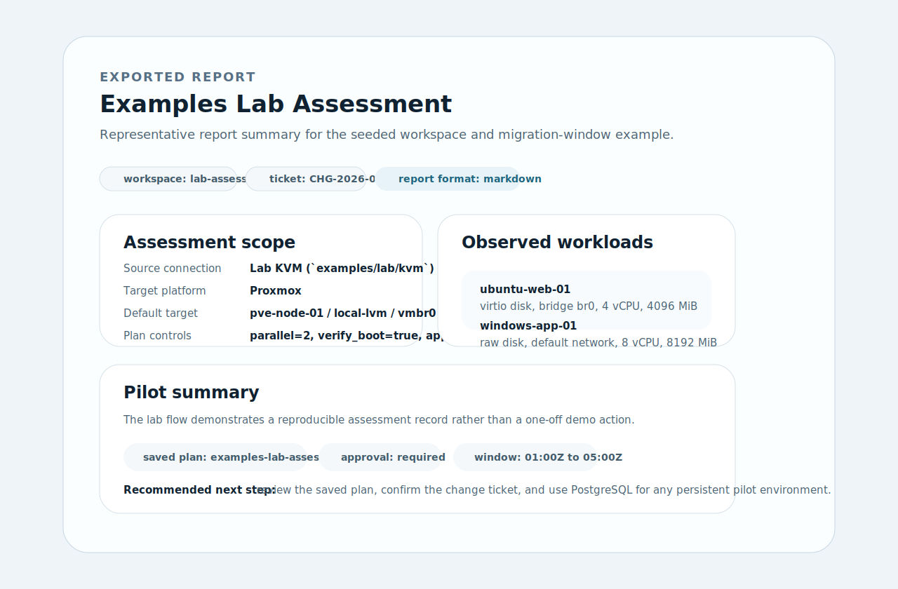

# Lab Screenshots

These screenshots are grounded in the current `examples/lab` seed data. They are meant to help evaluators understand what the local workspace flow and exported report should look like at a glance.

## Files

- [Lab workspace flow](lab-workspace-flow.svg)
- [Lab report export](lab-report-export.svg)

## Preview

## Notes

- `lab-workspace-flow.svg` uses the actual fixture names from `examples/lab/kvm/`.
- `lab-report-export.svg` reflects the seeded workspace intake and migration-window settings in this directory.
