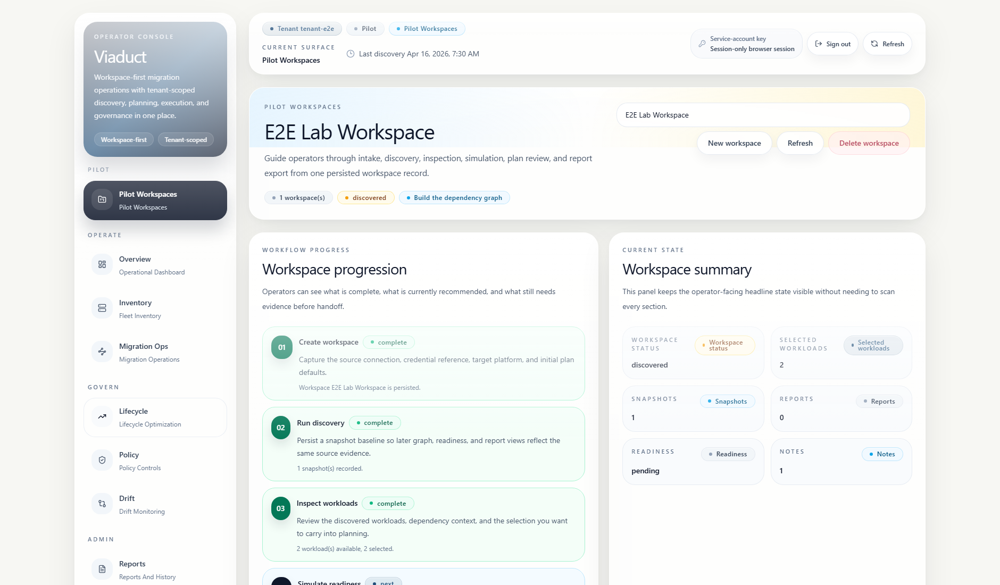
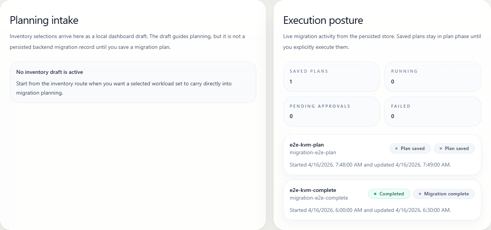

# Lab Screenshots

These screenshots are grounded in the current `examples/lab` seed data and match the packaged local runtime flow served by `viaduct start`.
Use them when you want a quick visual reference for the seeded local workspace path.

## Current Files

- [Lab workspace overview](lab-workspace-overview.png)
- [Lab migration operations](lab-migration-ops.png)

## Historical Files

- [Lab workspace flow SVG](lab-workspace-flow.svg)
- [Lab report export SVG](lab-report-export.svg)

The SVG captures remain for older release notes and archived collateral. New release-facing docs should prefer the PNG captures.

## Preview

## Notes

- `lab-workspace-overview.png` reflects the seeded pilot workspace state created from `examples/lab/pilot-workspace-create.json`.
- `lab-migration-ops.png` reflects the deterministic migration planning surface exposed by the local lab and Playwright fixture server.
